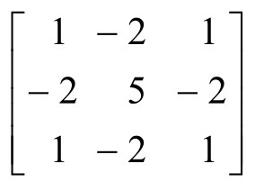
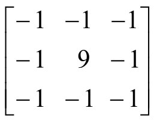
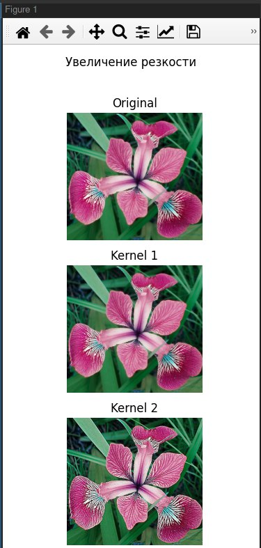

# Лабораторная работа №3
## Вариант 13
Локальная пороговая обработка (2 метода) + Адаптивная пороговая обработка + Реализация высокочастотных фильтров (увеличение резкости)
## Пример использования
### Реализация высокочастотных фильтров (увеличение резкости)
Фильтр 1:

Фильтр 2:

```
python main.py sharpen img.jpg
```

### Локальная пороговая обработка
Использу
